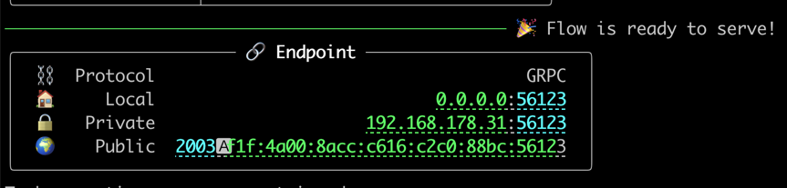

# video-chat

Jina-powered multi-user video chat, to showcase how to use to build a real-time streaming solution.


## Prerequisites

First, you need a webcam.

```bash
pip install -U jina docarray
```

## Run server

Server **doesn't need** a webcam of course.

```bash
git clone https://github.com/hanxiao/video-chat.git
cd video-chat
jina flow --uses flow.yml
```

Note down the server address:



### Run client

```bash
pip install opencv-python

git clone https://github.com/hanxiao/video-chat.git
cd video-chat
python client.py grpcs://your-server-address-from-last-image johannes
```

where `johannes` is the name of the user, must be different from other users.
